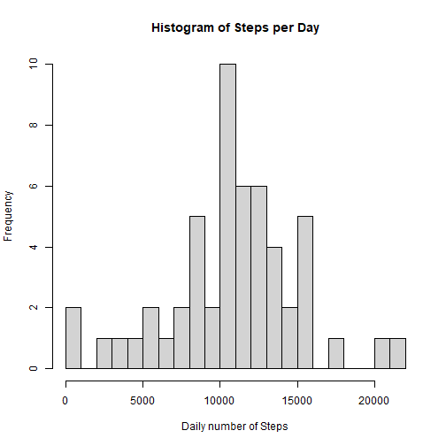
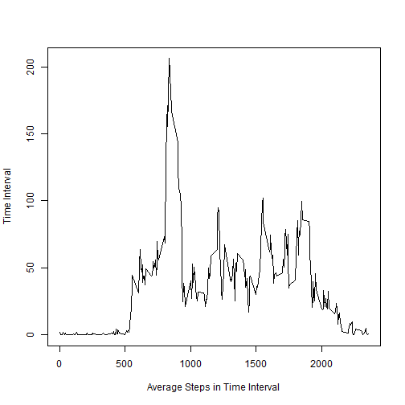
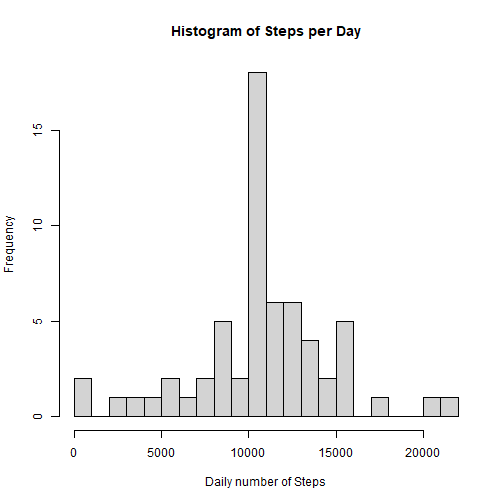
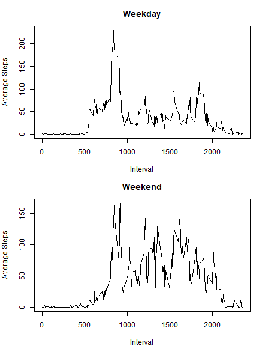

Programming Assignment #1
=========================
Jared Kramer


```r
library(dplyr)

knitr::opts_chunk$set(echo = TRUE)
```


### 1. Loading and Processing the Data

First, unzip the activity data if necessary, and read in the csv file into a data frame. 
To allow for splitting by date for later analysis, we convert the date field into factors. 


```r
  if(!file.exists("activity.csv")){
    unzip("activity.zip")
  }

  activityDF <- read.csv("activity.csv")
  activityDF$date <- as.Date(activityDF$date)
```


### 2. What is the mean total of steps taken per day?

In this section, we split the "steps" column of the data frame, according to the date of each observation.  


```r
  steps_by_day <- split(activityDF$steps, activityDF$date)
  dailysteps <- sapply(steps_by_day, sum)
  hist(dailysteps, breaks = 20, main = "Histogram of Steps per Day", xlab = "Daily number of Steps")
```



Ignoring NA's, we then compute the mean and the median, and display it inline below.


```r
  mean1 <- mean(dailysteps, na.rm = TRUE)
  median1 <- median(dailysteps, na.rm = TRUE)
```

The mean is 10766.1886792453 and the median is 10765.

### 3. What is the average daily activity pattern? 

In this section, we split the "steps" column of the data frame, according to the time interval of each observation. 


```r
  steps_by_interval <- split(activityDF$steps, activityDF$interval)
  intervalsteps <- sapply(steps_by_interval, mean, na.rm = TRUE)
  
  max_interval <- names(intervalsteps)[which.max(intervalsteps)]
  
  plot(x = names(intervalsteps), y = intervalsteps, type = "l", 
       xlab = "Average Steps in Time Interval", 
       ylab = "Time Interval")
```



The interval with the maximum average number of steps per day is 835

### 4. Inputing missing values


```r
  na_rows <- which(is.na(activityDF$steps))
  num_nas <- length(na_rows)
```

We identified the rows with NA values, and there are 2304 of them.  

Now we replace the NA `steps` values with the mean number of steps that we computed in the previous part, for the corresponding time interval. 


```r
  # copy to a new dataframe
  activityFilled <- activityDF
  
  #populate the NA values with the interval means computed from the above, for the corresponding 
  #time interval
  activityFilled[na_rows, ]$steps <-
    intervalsteps[as.character(activityDF[na_rows, ]$interval)]
```

Now, with the filled in data, we reconstruct the histogram of the number of daily steps.


```r
  steps_by_day_filled <- split(activityFilled$steps, activityFilled$date)
  dailysteps_filled <- sapply(steps_by_day_filled, sum)
  hist(dailysteps_filled, breaks = 20, main = "Histogram of Steps per Day", xlab = "Daily number of Steps")
```




Finally, we then compute the mean and the median, and display it inline below.


```r
  mean_filled <- mean(dailysteps_filled, na.rm = TRUE)
  median_filled <- median(dailysteps_filled, na.rm = TRUE)
```

Having filled in NA values, the new mean is 10766.1886792453.  
(Recall that prior to filling in NA values, the old mean was 10766.1886792453

Having filled in NA values, the new median is 10766.1886792453.  
(Recall that prior to filling in NA values, the old median was 10765

We note that the **mean** is the same -- introducing the mean number of steps by time interval, 
into the missing time intervals, does not introduce any bias.  
However, because we are filling in mean values into values that had previously been missing, 
the **median** has shifted (and is now equal to the mean, whereas before it was not). 

### 5.  Weekday vs. Weekend Patterns

First we define a function that maps days of the week to a factor with weekend / weekday labels. 

We then use that function to create a weekday / weekend classification for every observation in
the NA-filled data set. 


```r
f <- factor(c("weekday", "weekend"))
weekend <- function(day) {
  if((day == "Saturday") | (day == "Sunday")) f[2]
  else f[1]
}

activityFilled$day_type <- sapply(weekdays(activityFilled$date), weekend)
```


Next, we group the new data set by both interval and by the type of day (weekend / weekday).  

Then, for each interval / day type combination, we compute the mean number of steps.  


```r
grouped <- group_by(activityFilled, interval, day_type)
steps_by_interval2 <- summarise(grouped, steps = mean(steps))
```

```
## `summarise()` regrouping output by 'interval' (override with `.groups` argument)
```

```r
steps_weekday <- steps_by_interval2[steps_by_interval2$day_type == "weekday", ]
steps_weekend <- steps_by_interval2[steps_by_interval2$day_type == "weekend", ]
```


Finally, we plot, for both weekdays and weekends, the average number of steps in each interval.  


```r
par(mfrow = c(2, 1), mar = c(4, 4, 3, 1))
plot(steps_weekday$interval, steps_weekday$steps, type = "l", main = "Weekday", 
     xlab = "Interval", ylab = "Average Steps")
plot(steps_weekend$interval, steps_weekend$steps, type = "l", main = "Weekend", 
     xlab = "Interval", ylab = "Average Steps")
```




